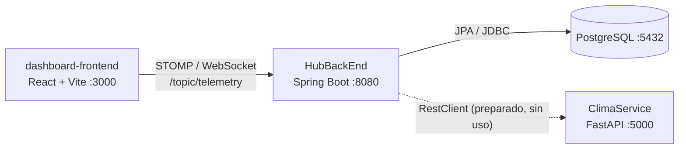

<div align="center">

# 🔴 Ares Colony

### Mission Control Platform

**El centro de operaciones de una colonia marciana, construido con microservicios y listo para despegar.**

<p>
  <a href="https://github.com/victorzurd/Docker-React-Ares-Colony"></a>
  
  
  
</p>

<p>
  <a href="#puesta-en-marcha">Puesta en marcha</a> ·
  <a href="#arquitectura">Arquitectura</a> ·
  <a href="#api-y-telemetria">API y telemetría</a> ·
  <a href="#limitaciones-conocidas">Limitaciones</a>
</p>

</div>

> Plataforma de monitorización para una colonia en Marte. Spring Boot persiste los colonos en PostgreSQL y emite telemetría ambiental en tiempo real por WebSocket (STOMP) hacia un dashboard React; FastAPI calcula el riesgo de tormenta de arena de cada misión.

<div align="center">

| 🖥️ Dashboard | ⚡ Tiempo real | 🧠 Análisis | 🐳 Un comando |
| :---: | :---: | :---: | :---: |
| React + Vite | WebSocket / STOMP | FastAPI | Docker Compose |

</div>

## 🧭 Índice

- [✨ Qué incluye](#que-incluye)
- [🧰 Stack tecnológico](#stack-tecnologico)
- [🏗️ Arquitectura](#arquitectura)
- [🚀 Puesta en marcha](#puesta-en-marcha)
- [⚙️ Configuración](#configuracion)
- [🔌 API y telemetría](#api-y-telemetria)
- [🛠️ Desarrollo local](#desarrollo-local)
- [⚠️ Limitaciones conocidas](#limitaciones-conocidas)

---

<a id="que-incluye"></a>

## ✨ Qué incluye

- **Telemetría en tiempo real (push)**: el backend publica cada 2 segundos oxígeno, presión, temperatura exterior y radiación en el canal `/topic/telemetry`; el dashboard se actualiza sin *polling*.
- **Dashboard de control de misión** (React + Tailwind): cuatro tarjetas de métricas e indicador de estado de conexión con reconexión automática (5 s).
- **API REST de colonos**: alta y consulta de colonos con persistencia real en PostgreSQL (JPA/Hibernate, esquema autogenerado).
- **Servicio de análisis de riesgo** (FastAPI): calcula el riesgo de tormenta de arena en función de la duración de la misión y clasifica el estado como `SEGURO` o `PELIGRO_TORMENTA`.
- **Datos semilla**: al arrancar, el backend registra un comandante de ejemplo.
- **Orquestación completa con Docker Compose**: 4 contenedores, red interna con resolución DNS por nombre de servicio y volumen persistente para la base de datos.
- **Build multi-stage** en el backend (compilación con Maven en imagen JDK 21, ejecución en imagen JRE 21 ligera).
- **Documentación OpenAPI automática** del servicio Python (`/docs`).

---

<a id="stack-tecnologico"></a>

## 🧰 Stack tecnológico

| Capa | Tecnologías |
| :--- | :--- |
| **Backend (Hub)** | Java 21 · Spring Boot 3.5 · Spring Web · Spring Data JPA · Spring WebSocket (STOMP + SockJS) · Lombok · Maven (wrapper incluido) |
| **Servicio analítico** | Python 3.11 · FastAPI · Uvicorn · Pydantic |
| **Frontend** | React 18 · Vite 5 · Tailwind CSS (CDN) · `@stomp/stompjs` · `lucide-react` |
| **Base de datos** | PostgreSQL 15 (Alpine) |
| **Infraestructura** | Docker · Docker Compose |
| **Imágenes base** | `maven:3.9-eclipse-temurin-21`, `eclipse-temurin:21-jre`, `python:3.11-slim`, `node:20-alpine`, `postgres:15-alpine` |

---

## 📁 Estructura del proyecto

```text
Docker-React-Ares-Colony/
├── docker-compose.yml                 # Orquestación de los 4 servicios
│
├── HubBackEnd/                        # API REST + WebSocket (Spring Boot, :8080)
│   ├── Dockerfile                     # Build multi-stage (Maven → JRE 21)
│   ├── pom.xml
│   ├── mvnw / mvnw.cmd                # Maven Wrapper
│   └── src/main/
│       ├── java/com/arescolony/
│       │   ├── AresColonyApplication.java   # Arranque + carga de datos semilla
│       │   ├── TelemetryScheduler.java      # Emisión de telemetría cada 2 s
│       │   ├── WebSocketConfig.java         # Broker STOMP y endpoint /ws-ares
│       │   ├── controller/ColonoController.java
│       │   ├── model/Colono.java            # Entidad JPA
│       │   └── repository/ColonoRepository.java
│       └── resources/application.properties
│
├── ClimaService/                      # Microservicio analítico (FastAPI, :5000)
│   ├── clima_analyzer.py
│   ├── requirements.txt
│   └── Dockerfile
│
└── dashboard-frontend/                # Panel de control (React + Vite, :3000)
    ├── src/
    │   ├── main.jsx
    │   └── App.jsx                    # Cliente STOMP + tarjetas de métricas
    ├── index.html
    ├── vite.config.js
    ├── package.json
    └── Dockerfile
```

<a id="arquitectura"></a>

## 🏗️ Arquitectura



---

<a id="puesta-en-marcha"></a>

## 🚀 Puesta en marcha

### Requisitos previos

| Modo | Necesitas |
| :--- | :--- |
| **Docker (recomendado)** | Docker Engine 20.10+ o Docker Desktop, con **Docker Compose v2** (`docker compose`) |
| **Desarrollo local (sin Docker)** | JDK 21 · Node.js 20+ · Python 3.11+ · una instancia de PostgreSQL 15 (puedes usar el contenedor del compose) |

Puertos libres en el host: `3000`, `5000`, `5432` y `8080`.

### Opción A · Docker Compose (recomendada)

```bash
# 1. Clonar el repositorio
git clone https://github.com/victorzurd/Docker-React-Ares-Colony.git
cd Docker-React-Ares-Colony

# 2. Construir y levantar todos los servicios
docker compose up --build

# (opcional) en segundo plano y consulta de logs
docker compose up --build -d
docker compose logs -f hub-java
```

Cuando los contenedores estén en marcha:

| Servicio | URL |
| :--- | :--- |
| Dashboard | http://localhost:3000 |
| API REST (Hub) | http://localhost:8080/api/colonos |
| Servicio analítico | http://localhost:5000/docs |
| PostgreSQL | `localhost:5432` |

Para detener el entorno:

```bash
docker compose down        # detiene y elimina los contenedores (conserva los datos)
docker compose down -v     # además elimina el volumen de PostgreSQL (borra los datos)
```

<a id="opcion-b-desarrollo-local"></a>

### Opción B · Desarrollo local por servicios

Ejecuta cada componente en una terminal distinta.

**1. Base de datos** (reutiliza el contenedor del compose):

```bash
docker compose up -d postgres-db
```

**2. Servicio analítico (Python)**

```bash
cd ClimaService
python3 -m venv .venv
source .venv/bin/activate            # Windows: .venv\Scripts\activate
pip install -r requirements.txt
uvicorn clima_analyzer:app --host 0.0.0.0 --port 5000 --reload
```

**3. Backend (Spring Boot)**

`application.properties` apunta por defecto al host `postgres-db` (válido solo dentro de Docker), por lo que hay que sobrescribir la URL de conexión al ejecutar en local:

```bash
cd HubBackEnd
# Linux / macOS
SPRING_DATASOURCE_URL=jdbc:postgresql://localhost:5432/ares_colony_db ./mvnw spring-boot:run
```

```powershell
# Windows (PowerShell)
cd HubBackEnd
$env:SPRING_DATASOURCE_URL="jdbc:postgresql://localhost:5432/ares_colony_db"; .\mvnw.cmd spring-boot:run
```

> La primera ejecución del Maven Wrapper descarga Maven 3.9.x, por lo que requiere conexión a Internet.

**4. Frontend (React)**

```bash
cd dashboard-frontend
npm install
npm run dev                          # http://localhost:3000
```

---

<a id="configuracion"></a>

## ⚙️ Configuración

El proyecto **no utiliza ficheros `.env`**. La configuración se define en `docker-compose.yml` y en `HubBackEnd/src/main/resources/application.properties`.

### Definidas en `docker-compose.yml`

| Variable | Servicio | Valor actual | Descripción |
| :--- | :--- | :--- | :--- |
| `POSTGRES_DB` | `postgres-db` | `ares_colony_db` | Nombre de la base de datos creada al inicializar. |
| `POSTGRES_USER` | `postgres-db` | `astronauta` | Usuario de la base de datos. |
| `POSTGRES_PASSWORD` | `postgres-db` | `marte_password` | Contraseña del usuario. |
| `SPRING_DATASOURCE_URL` | `hub-java` | `jdbc:postgresql://postgres-db:5432/ares_colony_db` | URL JDBC del backend. Sobrescribe la propiedad homónima de `application.properties`. |

### Propiedades de Spring (`application.properties`)

| Propiedad | Valor por defecto | Descripción |
| :--- | :--- | :--- |
| `spring.datasource.username` | `astronauta` | Usuario de conexión (debe coincidir con `POSTGRES_USER`). |
| `spring.datasource.password` | `marte_password` | Contraseña de conexión (debe coincidir con `POSTGRES_PASSWORD`). |
| `spring.jpa.hibernate.ddl-auto` | `update` | Crea/actualiza las tablas automáticamente. |
| `spring.jpa.show-sql` | `true` | Muestra las consultas SQL en el log. |

Cualquier propiedad de Spring puede sobrescribirse mediante variables de entorno (*relaxed binding*), por ejemplo `SPRING_DATASOURCE_USERNAME` y `SPRING_DATASOURCE_PASSWORD`.

### Valores fijados en el código

| Valor | Ubicación | Nota |
| :--- | :--- | :--- |
| `ws://localhost:8080/ws-ares/websocket` | `dashboard-frontend/src/App.jsx` | URL del WebSocket; se resuelve desde el navegador del host. |
| `http://cerebro-python:5000` | `ColonoController.java` | URL del servicio analítico (nombre DNS de Compose). |

> Las credenciales incluidas son **exclusivamente de demostración**. Cámbialas y externalízalas (por ejemplo, con un `.env` o *Docker secrets*) en cualquier entorno que no sea local.

---

<a id="api-y-telemetria"></a>

## 🔌 API y telemetría

### Dashboard

Abre **http://localhost:3000**. El indicador superior pasa a `ONLINE (WS)` al conectar con el backend y las cuatro tarjetas (oxígeno, presión, temperatura exterior y radiación) se actualizan cada 2 segundos.

### API REST · Hub (`http://localhost:8080`)

| Método | Ruta | Descripción |
| :--- | :--- | :--- |
| `GET` | `/api/colonos` | Lista todos los colonos. |
| `POST` | `/api/colonos` | Registra un nuevo colono. |

**Modelo `Colono`**

| Campo | Tipo | Notas |
| :--- | :--- | :--- |
| `id` | `Long` | Autogenerado (`IDENTITY`). |
| `nombre` | `String` | |
| `rol` | `String` | Ejemplos: `INGENIERO`, `CIENTIFICO`, `COMANDANTE`. |
| `nivelOxigenoTraje` | `int` | Porcentaje de oxígeno del traje. |

```bash
# Listar colonos
curl http://localhost:8080/api/colonos

# Registrar un colono
curl -X POST http://localhost:8080/api/colonos \
  -H "Content-Type: application/json" \
  -d '{"nombre": "Elena Ríos", "rol": "INGENIERO", "nivelOxigenoTraje": 95}'
```

```json
{
  "id": 2,
  "nombre": "Elena Ríos",
  "rol": "INGENIERO",
  "nivelOxigenoTraje": 95
}
```

### Telemetría en tiempo real · WebSocket / STOMP

| Elemento | Valor |
| :--- | :--- |
| Endpoint SockJS | `http://localhost:8080/ws-ares` |
| Endpoint WebSocket nativo | `ws://localhost:8080/ws-ares/websocket` (el que usa el dashboard) |
| Suscripción | `/topic/telemetry` |
| Frecuencia | Cada 2 segundos |
| Prefijo de destinos de aplicación | `/app` (configurado; sin *handlers* actualmente) |

**Mensaje emitido** (valores simulados):

```json
{
  "oxigeno": 95.3,
  "presion": 1.04,
  "temperatura": -58.7,
  "radiacion": 23,
  "timestamp": 1788000000000
}
```

| Campo | Rango simulado | Unidad |
| :--- | :--- | :--- |
| `oxigeno` | 90 – 100 | % |
| `presion` | 0.9 – 1.1 | atm |
| `temperatura` | −65 – −55 | °C |
| `radiacion` | 0 – 49 (entero) | mSv |
| `timestamp` | Epoch | ms |

**Cliente mínimo con `@stomp/stompjs`:**

```js
import { Client } from '@stomp/stompjs';

const client = new Client({
  brokerURL: 'ws://localhost:8080/ws-ares/websocket',
  onConnect: () =>
    client.subscribe('/topic/telemetry', (msg) => console.log(JSON.parse(msg.body))),
});
client.activate();
```

### API REST · Servicio analítico (`http://localhost:5000`)

| Método | Ruta | Descripción |
| :--- | :--- | :--- |
| `POST` | `/analizar-riesgo` | Calcula el riesgo de tormenta de arena de una misión. |
| `GET` | `/docs` | Documentación interactiva (Swagger UI). |

**Regla de negocio:** `riesgo = min(horas_duracion × 12, 100)`. Si `riesgo < 50` el estado es `SEGURO`; en caso contrario, `PELIGRO_TORMENTA` (es decir, misiones de 5 horas o más).

```bash
curl -X POST http://localhost:5000/analizar-riesgo \
  -H "Content-Type: application/json" \
  -d '{"horas_duracion": 6, "id_colono": 1}'
```

```json
{
  "riesgo_porcentaje": 72,
  "estado_mision": "PELIGRO_TORMENTA"
}
```

---

<a id="desarrollo-local"></a>

## 🛠️ Desarrollo local

Los comandos completos para ejecutar cada servicio sin Docker están documentados en [Opción B · Desarrollo local por servicios](#opcion-b-desarrollo-local). Para el frontend:

```bash
cd dashboard-frontend
npm install
npm run dev
```

Para validar el build de producción del dashboard:

```bash
npm run build
```

<a id="limitaciones-conocidas"></a>

## ⚠️ Limitaciones conocidas

Aspectos detectados durante el análisis estático del código (no se ha ejecutado el stack completo):

- **Arranque no sincronizado**: `depends_on` solo espera al *inicio* del contenedor de PostgreSQL, no a que acepte conexiones (no hay `healthcheck`). El backend puede fallar en el primer arranque; en ese caso, vuelve a ejecutar `docker compose up`.
- **Integración Hub ↔ Python pendiente**: el backend instancia un `RestClient` hacia `cerebro-python`, pero ningún endpoint lo invoca; el dashboard tampoco consume la API REST ni el servicio de riesgo.
- **Telemetría simulada**: los valores son aleatorios y no se persisten ni se asocian a colonos.
- **Datos semilla duplicados**: `AresColonyApplication` inserta al comandante *Alex Vance* en cada arranque; con el volumen de PostgreSQL persistente se acumulan duplicados en cada reinicio.
- **Seguridad**: sin autenticación en REST ni WebSocket, orígenes WebSocket abiertos (`*`), credenciales en texto plano y puerto `5432` publicado en el host. Uso previsto: desarrollo local.
- **Configuración residual**: `application.properties` contiene claves duplicadas (H2 y PostgreSQL; prevalece PostgreSQL) y `pom.xml` mantiene la dependencia de H2 y los metadatos por defecto (`com.example:demo`).
- **Frontend en modo desarrollo**: el contenedor ejecuta el servidor de desarrollo de Vite (no un build de producción) y Tailwind se carga desde CDN, por lo que el navegador necesita Internet. Las dependencias `sockjs-client`, `tailwindcss`, `postcss` y `autoprefixer` no se utilizan actualmente.
- **Visualización de ceros**: en `App.jsx`, un valor `0` (p. ej. radiación de 0 mSv) se muestra como `--` por evaluarse como *falsy*.
- **Cobertura de pruebas**: solo existe el test de plantilla `DemoApplicationTests`; el `Dockerfile` del backend compila con `-DskipTests`.
- **Aviso de Compose**: la clave `version` del `docker-compose.yml` está obsoleta en Compose v2 y genera un *warning* inofensivo.
